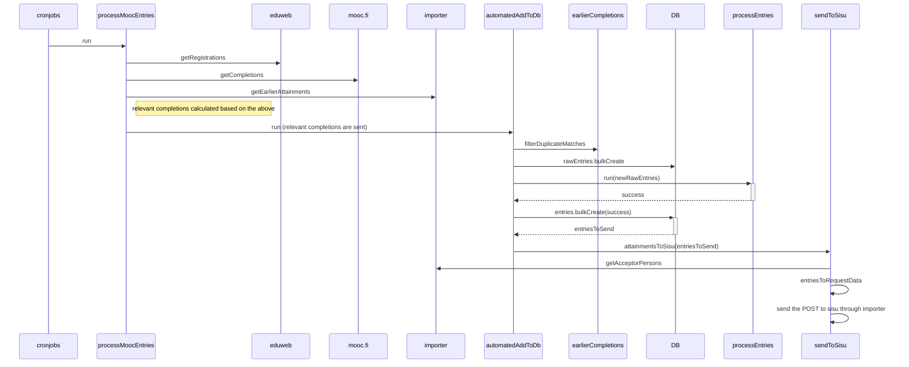

### Mooc-cron

### processEntries

Mankel raw entries to sis entries.

Some extra mayhem with grader and course relations as createdEntries contains only raw entries and related foreign keys. We can't query raw entries with include as we are inside a transaction and relations needs to be fetched separately.

Mankeling steps:

1. Fetch relations from local db, fetch all necessary persons, attainments etc from importer
2. Fetch enrolments from importer with person id - course code pairs
3. From the enrolments find instances which are for proper course unit realisation, based on the attainment date
4. Mankel again the enrolments to get Suotar entries
5. Resolve all nested promises ??
 
Returns list with three elements:
 [failedEntries, validEntries, isMissingEnrollment]
