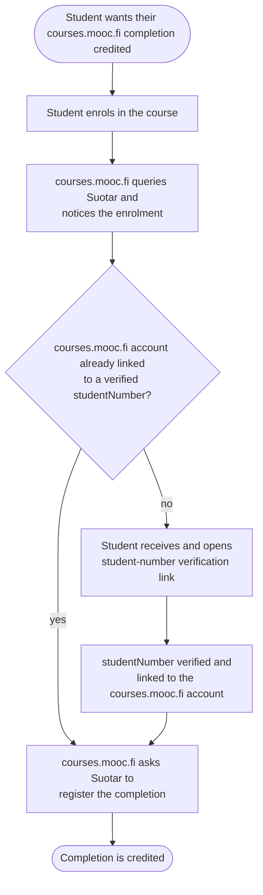
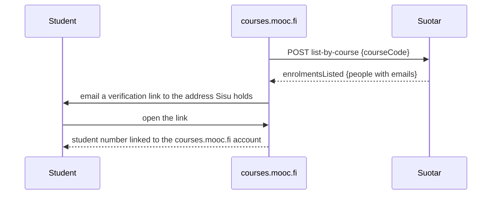
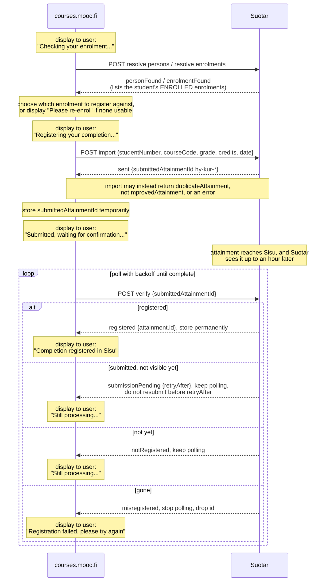

# Suotar APIs for registering courses.mooc.fi completions in Sisu

courses.mooc.fi will use these APIs to register course completions as Sisu attainments, link courses.mooc.fi accounts to Sisu student numbers, and to get access tokens required for Sisu enrolment links.

Adapted from the [original proposal](https://gist.github.com/nygrenh/3d505fff6d747d550b0c2d63a824bfbb); this document describes what Suotar implements.

## API shape

Every endpoint is a batch endpoint. A request is a JSON array of items, each with a `requestItemId` set by courses.mooc.fi. The response is an array with one item per request item, carrying the same `requestItemId` back. A `requestItemId` must be unique within its batch; Suotar does not read it otherwise, and does not use it to recognise a retry.

Every request is authenticated with an API key Suotar issues, sent as `Authorization: Bearer <token>`.

Each endpoint caps how many items one batch may hold; the limit is given per section below.

Each response item carries a `status` and a `code`:

- `ok`: a `result` object. `code` names the success (`personFound`, `registered`).
- `error`: an `error` object with a `message`. `code` names the error (`personNotFound`).

Per-item outcomes always return HTTP 200; the outcome is in each item's `status` and `code`. HTTP 4xx and 5xx are for request-level failures that reject the whole call (see Request-level errors below).

Example request with two items:

**Request**

```http
POST /api/persons/resolve-by-student-numbers
Content-Type: application/json

[
  { "requestItemId": "a1", "studentNumber": "012345678" },
  { "requestItemId": "b2", "studentNumber": "999999999" }
]
```

**Response: HTTP 200**

```json
[
  {
    "requestItemId": "a1",
    "status": "ok",
    "code": "personFound",
    "result": {
      "studentNumber": "012345678",
      "personId": "otm-person-id",
      "firstNames": "Henrik Admin",
      "lastName": "Nygren"
    }
  },
  {
    "requestItemId": "b2",
    "status": "error",
    "code": "personNotFound",
    "error": { "message": "No Sisu person was found for the supplied student number." }
  }
]
```

### Request-level errors

Not batch item results. These fail the whole request with HTTP 4xx or 5xx. Per-item outcomes, including per-item errors, always return HTTP 200.

- `malformedRequest` (400): the body is not a JSON array, an item is one the endpoint cannot read, a `requestItemId` is missing or repeated, or the batch is over the size limit. The per-item codes describe outcomes for a well-formed item, so a bad shape has nothing to map onto.
- `unauthorized` (401): missing or invalid credentials.
- `requestTooLarge` (413): the body is over 5 MB.
- `serviceTemporarilyUnavailable` (503): Suotar could not read Sisu. Every lookup behind these endpoints is batch-wide, so no item is left with an outcome of its own. Retry the whole batch; section 3 writes nothing unless every item resolved.
- `internalError` (500).

Example:

```json
{
  "error": {
    "code": "malformedRequest",
    "message": "Request body must be a JSON array of request items."
  }
}
```

## Typical usage

**Account linking.** courses.mooc.fi asks Suotar for the people enrolled in a course and emails a verification link to the address Sisu holds. The verification link is used to link a courses.mooc.fi account with their student number.

**Registration.** courses.mooc.fi resolves the person and enrolment, submits the attainment, then polls until a final result. Import returns `sent`, not `registered`: the attainment reaches Sisu asynchronously. courses.mooc.fi holds the submitted id, polls verify, and stores `attainment.id` once Sisu confirms.

**The delay.** Suotar reads not Sisu but a copy refreshed periodically, so an attainment or enrolment can take up to about an hour to appear. Everything Suotar tells you about Sisu is subject to that delay, section 4 verify included, so poll with backoff rather than at a fixed few-minute interval.

<details>
<summary>Diagram: Order of events</summary>



</details>

<details>
<summary>Diagram: confirming a student number (account linking)</summary>



</details>

<details>
<summary>Diagram: registering a completion</summary>



</details>

## 1. Resolve persons

`POST /api/persons/resolve-by-student-numbers`

Matches a student number to a Sisu person and returns their info.

Result codes: `personFound`, `personNotFound`.

A batch holds at most 1000 items.

**Request**

```http
POST /api/persons/resolve-by-student-numbers
Content-Type: application/json

[
  {
    "requestItemId": "person-1",
    "studentNumber": "012345678"
  },
  {
    "requestItemId": "person-2",
    ...
  }
]
```

**Response: `personFound`**

```json
[
  {
    "requestItemId": "person-1",
    "status": "ok",
    "code": "personFound",
    "result": {
      "studentNumber": "012345678",
      "personId": "otm-person-id",
      "firstNames": "Henrik Admin",
      "lastName": "Nygren"
    }
  },
  {
    "requestItemId": "person-2",
    ...
  }
]
```

<details>
<summary>Error response: personNotFound (no Sisu person found)</summary>

```json
[
  {
    "requestItemId": "person-1",
    "status": "error",
    "code": "personNotFound",
    "error": {
      "message": "No Sisu person was found for the supplied student number."
    }
  }
]
```

</details>

## 2. Resolve enrolments

`POST /api/enrolments/resolve`

Checks that the student has a usable Sisu enrolment before courses.mooc.fi imports. `result.enrolments` lists every matching enrolment; `studyRightValidityPeriod` is omitted from one whose study right did not resolve. `gradeScaleId` is the scale section 3 requires.

Result codes: `enrolmentFound`, `personNotFound`, `courseCodeNotFound`, `enrolmentNotFound`, `enrolmentNotAccepted`. The last cannot currently occur: Suotar only ever sees enrolments in state `ENROLLED`, so an unaccepted one is indistinguishable from none and comes back as `enrolmentNotFound`.

A batch holds at most 1000 items.

**Request**

```http
POST /api/enrolments/resolve
Content-Type: application/json

[
  {
    "requestItemId": "enrolment-1",
    "studentNumber": "012345678",
    "courseCode": "TKT10001"
  },
  {
    "requestItemId": "enrolment-2",
    ...
  }
]
```

**Response: `enrolmentFound`**

```json
[
  {
    "requestItemId": "enrolment-1",
    "status": "ok",
    "code": "enrolmentFound",
    "result": {
      "enrolments": [
        {
          "id": "degree-enrolment-id",
          "state": "ENROLLED",
          "kind": "degree",
          "courseUnitId": "hy-CU-118023774-2021-08-01",
          "assessmentItemId": "hy-AI-118023774",
          "courseUnitRealisationId": "hy-opt-cur-degree",
          "courseUnitRealisationName": {
            "fi": "Johdatus tietojenkasittelytieteeseen, kevat 2026",
            "sv": "Introduktion till datavetenskap, varen 2026",
            "en": "Introduction to Computer Science, spring 2026"
          },
          "activityPeriod": {
            "startDate": "2026-03-01",
            "endDate": "2026-06-30"
          },
          "gradeScaleId": "sis-hyl-hyv",
          "credits": {
            "min": 5,
            "max": 5
          },
          "studyRightId": "otm-degree-study-right-id",
          "studyRightValidityPeriod": {
            "startDate": "2024-08-01",
            "endDate": "2030-07-31"
          },
          "enrolmentDateTime": "2026-05-20T09:10:00Z"
        },
        {
          "id": "open-enrolment-id",
          "state": "ENROLLED",
          "kind": "openUniversity",
          "courseUnitId": "hy-CU-118023774-2021-08-01",
          "assessmentItemId": "hy-AI-open",
          "courseUnitRealisationId": "hy-opt-cur-open",
          "courseUnitRealisationName": {
            "fi": "Johdatus tietojenkasittelytieteeseen (avoin yo), kevat 2026",
            "sv": "Introduktion till datavetenskap (oppna uni), varen 2026",
            "en": "Introduction to Computer Science (Open University), spring 2026"
          },
          "activityPeriod": {
            "startDate": "2026-01-01",
            "endDate": "2026-05-31"
          },
          "gradeScaleId": "sis-hyl-hyv",
          "credits": {
            "min": 5,
            "max": 5
          },
          "studyRightId": "hy-open-study-right-id",
          "studyRightValidityPeriod": {
            "startDate": "2026-01-01",
            "endDate": "2026-12-31"
          },
          "enrolmentDateTime": "2026-05-22T10:15:30Z"
        }
      ],
      "existingAttainments": []
    }
  },
  {
    "requestItemId": "enrolment-2",
    ...
  }
]
```

<details>
<summary>Success variant: enrolmentFound, with existing attainments</summary>

`existingAttainments` lists attainments Sisu already has for this person and course, so courses.mooc.fi can spot a prior result before importing. The `enrolments` entries are abbreviated here; the full field set is in the main response above.

```json
[
  {
    "requestItemId": "enrolment-1",
    "status": "ok",
    "code": "enrolmentFound",
    "result": {
      "enrolments": [
        {
          "id": "otm-enrolment-id",
          "courseUnitId": "hy-CU-118023774-2021-08-01",
          "assessmentItemId": "hy-AI-118023774",
          "courseUnitRealisationId": "hy-opt-cur-...",
          "studyRightId": "otm-study-right-id",
          "state": "ENROLLED",
          "gradeScaleId": "sis-0-5"
        }
      ],
      "existingAttainments": [
        {
          "id": "existing-attainment-id",
          "type": "AssessmentItemAttainment",
          "state": "ATTAINED",
          "personId": "otm-person-id",
          "courseUnitId": "hy-CU-118023774-2021-08-01",
          "assessmentItemId": "hy-AI-118023774",
          "courseUnitRealisationId": "hy-opt-cur-...",
          "attainmentDate": "2026-03-01",
          "registrationDate": "2026-03-05",
          "gradeScaleId": "sis-0-5",
          "gradeId": "3",
          "passed": true
        }
      ]
    }
  }
]
```

</details>

<details>
<summary>Error response: personNotFound (no Sisu person found)</summary>

```json
[
  {
    "requestItemId": "enrolment-1",
    "status": "error",
    "code": "personNotFound",
    "error": {
      "message": "No Sisu person was found for the supplied student number."
    }
  }
]
```

</details>

<details>
<summary>Error response: courseCodeNotFound (course code not resolved in Sisu)</summary>

```json
[
  {
    "requestItemId": "enrolment-1",
    "status": "error",
    "code": "courseCodeNotFound",
    "error": {
      "message": "Course code could not be resolved in Sisu."
    }
  }
]
```

</details>

## 3. Import attainments

`POST /api/attainments/import`

Creates completions as attainments in Sisu.

Sisu rejects an attainment dated outside the student's study right, so Suotar moves the date into range where necessary. The response does not currently report the date actually registered.

Success codes: `sent`, `duplicateAttainment`, `notImprovedAttainment`.

Error codes: `personNotFound`, `enrolmentNotFound`, `invalidGradeForGradeScale`, `gradeScaleMismatch`, `courseNotAllowed`, `invalidCredits`, `studyRightNotValid`, `sisuValidationFailed`, and `sisuTimeout`.

A batch holds at most 100 items. Allow it a few minutes before your client gives up: a response you never receive is the one case Suotar cannot protect you from resubmitting into.

**Request**

```http
POST /api/attainments/import
Content-Type: application/json

[
  {
    "requestItemId": "moocfi-completion-12345",
    "studentNumber": "012345678",
    "courseCode": "TKT10001",
    "enrolmentId": "selected-enrolment-id",
    "attainmentDate": "2026-05-22",
    "attainmentLanguage": "fi",
    "gradeScaleId": "sis-hyl-hyv",
    "gradeId": "1",
    "credits": 5
  },
  {
    "requestItemId": "moocfi-completion-12346",
    ...
  }
]
```

**Response**

```json
[
  {
    "requestItemId": "moocfi-completion-12345",
    "status": "ok",
    "code": "sent",
    "result": {
      "submittedAttainmentId": "hy-kur-...",
      "submittedAttainmentType": "AssessmentItemAttainment"
    }
  },
  {
    "requestItemId": "moocfi-completion-12346",
    ...
  }
]
```

<details>
<summary>Success response: duplicateAttainment (matching attainment already exists)</summary>

```json
[
  {
    "requestItemId": "moocfi-completion-12345",
    "status": "ok",
    "code": "duplicateAttainment",
    "result": {
      "attainment": {
        "id": "existing-attainment-id",
        "type": "CourseUnitAttainment",
        "state": "ATTAINED",
        "attainmentDate": "2026-05-22",
        "registrationDate": "2026-05-22",
        "gradeScaleId": "sis-hyl-hyv",
        "gradeId": "1"
      }
    }
  }
]
```

</details>

<details>
<summary>Success response: notImprovedAttainment (equal or better attainment exists)</summary>

```json
[
  {
    "requestItemId": "moocfi-completion-12345",
    "status": "ok",
    "code": "notImprovedAttainment",
    "result": {
      "previousAttainment": {
        "id": "existing-attainment-id",
        "type": "CourseUnitAttainment",
        "state": "ATTAINED",
        "gradeScaleId": "sis-0-5",
        "gradeId": "5",
        "attainmentDate": "2026-03-01",
        "registrationDate": "2026-03-05"
      }
    }
  }
]
```

</details>

<details>
<summary>Error response: personNotFound (no Sisu person found)</summary>

```json
[
  {
    "requestItemId": "moocfi-completion-12345",
    "status": "error",
    "code": "personNotFound",
    "error": {
      "message": "No Sisu person was found for the supplied student number."
    }
  }
]
```

</details>

<details>
<summary>Error response: enrolmentNotFound (no usable enrolment, ask the student to re-enrol)</summary>

```json
[
  {
    "requestItemId": "moocfi-completion-12345",
    "status": "error",
    "code": "enrolmentNotFound",
    "error": {
      "message": "No ENROLLED Sisu enrolment was found for this student and course code."
    }
  }
]
```

</details>

<details>
<summary>Error response: invalidGradeForGradeScale (grade invalid for the resolved scale)</summary>

```json
[
  {
    "requestItemId": "moocfi-completion-12345",
    "status": "error",
    "code": "invalidGradeForGradeScale",
    "error": {
      "message": "Grade id is not valid for the resolved enrolment's grade scale."
    }
  }
]
```

</details>

<details>
<summary>Error response: gradeScaleMismatch (gradeScaleId is not the enrolment's scale)</summary>

```json
[
  {
    "requestItemId": "moocfi-completion-12345",
    "status": "error",
    "code": "gradeScaleMismatch",
    "error": {
      "message": "Grade scale sis-hyl-hyv was sent, but the enrolment is graded on sis-0-5."
    }
  }
]
```

</details>

<details>
<summary>Error responses: courseNotAllowed, invalidCredits, studyRightNotValid, sisuValidationFailed (other per-item errors)</summary>

These share the same per-item error shape and differ only in `code` and `message`. `courseNotAllowed` means the course code is not in Suotar's own course list, which an admin maintains by hand; section 7 answers whether a code has been added without submitting a completion. Example:

```json
[
  {
    "requestItemId": "moocfi-completion-12345",
    "status": "error",
    "code": "studyRightNotValid",
    "error": {
      "message": "Study right cannot support the attainment."
    }
  }
]
```

</details>

<details>
<summary>Error response: sisuTimeout (timed out, result unknown; verify before retrying)</summary>

The submission may or may not have landed. courses.mooc.fi must verify before retrying, or it risks a double submission. The `submittedAttainmentId` comes back as it does on `sent`, because section 4 needs it.

```json
[
  {
    "requestItemId": "moocfi-completion-12345",
    "status": "error",
    "code": "sisuTimeout",
    "error": {
      "message": "Sisu operation timed out; outcome is uncertain."
    },
    "result": {
      "submittedAttainmentId": "hy-kur-...",
      "submittedAttainmentType": "AssessmentItemAttainment"
    }
  }
]
```

</details>

## 4. Verify attainments

`POST /api/attainments/verify`

Checks whether a submitted attainment reached its final state in Sisu.

Result codes: `registered`, `notRegistered`, `submissionPending`, `misregistered`.

A batch holds at most 1000 items.

**Request**

```http
POST /api/attainments/verify
Content-Type: application/json

[
  {
    "requestItemId": "verify-1",
    "submittedAttainmentId": "hy-kur-..."
  },
  {
    "requestItemId": "verify-2",
    ...
  }
]
```

**Response: `registered`**

```json
[
  {
    "requestItemId": "verify-1",
    "status": "ok",
    "code": "registered",
    "result": {
      "attainment": {
        "id": "final-sisu-course-unit-attainment-id",
        "type": "CourseUnitAttainment"
      }
    }
  },
  {
    "requestItemId": "verify-2",
    ...
  }
]
```

<details>
<summary>Error response: notRegistered (no evidence yet, keep polling)</summary>

```json
[
  {
    "requestItemId": "verify-1",
    "status": "error",
    "code": "notRegistered",
    "error": {
      "message": "No final or partial Sisu registration evidence was found for the submitted attainment id."
    }
  }
]
```

</details>

<details>
<summary>Error response: submissionPending (submitted too recently to be visible, keep polling)</summary>

An id Sisu has not shown Suotar yet, but which Suotar submitted less than two hours ago. Because of the delay above, "no attainment" on its own cannot tell a submission that failed from one Sisu has simply not handed over yet; Suotar's own record of the send can.

Keep polling, exactly as for `notRegistered`. The difference is resubmitting: until `retryAfter`, a fresh import of the same completion risks a second attainment in Sisu, because the duplicate check reads the same delayed copy. Only a submission that reached Sisu is held open this way — one Sisu refused (`sisuValidationFailed`) is `notRegistered` at once, so a correction can go straight back in.

```json
[
  {
    "requestItemId": "verify-1",
    "status": "error",
    "code": "submissionPending",
    "error": {
      "message": "This attainment was submitted too recently for Sisu to have shown it to Suotar yet. Keep polling; do not resubmit before retryAfter."
    },
    "result": {
      "submittedAttainmentId": "hy-kur-...",
      "submittedAttainmentType": "AssessmentItemAttainment",
      "retryAfter": "2026-09-01T14:32:00Z"
    }
  }
]
```

</details>

<details>
<summary>Error response: misregistered (was registered, now reversed in Sisu; stop polling, drop the id)</summary>

```json
[
  {
    "requestItemId": "verify-1",
    "status": "error",
    "code": "misregistered",
    "error": {
      "message": "A previously registered attainment has been marked misregistered in Sisu."
    }
  }
]
```

</details>

## 5. Product access tokens

`POST /api/open-university-product-access-tokens/resolve`

Would return the access tokens courses.mooc.fi uses to build Open University enrolment links.

**Not implemented yet.** The other endpoints do not depend on it.

## 6. List enrolled people by course

`POST /api/enrolments/list-by-course`

Mostly for account linking: returns the people enrolled in a course with the emails Sisu holds, so courses.mooc.fi can email a student number verification link.

The list is trimmed to realisations whose activity period ended less than two months ago; a course with none left in that window answers `courseCodeNotFound`.

Result codes: `enrolmentsListed`, `courseCodeNotFound`.

A batch holds at most 50 items.

**Request**

```http
POST /api/enrolments/list-by-course
Content-Type: application/json

[
  {
    "requestItemId": "people-1",
    "courseCode": "TKT10001"
  },
  {
    "requestItemId": "people-2",
    ...
  }
]
```

**Response: `enrolmentsListed`**

```json
[
  {
    "requestItemId": "people-1",
    "status": "ok",
    "code": "enrolmentsListed",
    "result": {
      "people": [
        {
          "studentNumber": "012345678",
          "personId": "otm-person-id",
          "firstNames": "Henrik Admin",
          "lastName": "Nygren",
          "primaryEmail": "henrik.nygren@helsinki.fi",
          "secondaryEmail": "henrik.nygren@example.com",
          "enrolment": {
            "id": "otm-enrolment-id",
            "courseUnitRealisationId": "hy-opt-cur-...",
            "state": "ENROLLED",
            "enrolmentDateTime": "2026-05-22T10:15:30Z"
          }
        }
      ]
    }
  },
  {
    "requestItemId": "people-2",
    ...
  }
]
```

<details>
<summary>Error response: courseCodeNotFound (course code not resolved in Sisu)</summary>

```json
[
  {
    "requestItemId": "people-1",
    "status": "error",
    "code": "courseCodeNotFound",
    "error": {
      "message": "Course code could not be resolved in Sisu."
    }
  }
]
```

</details>

## 7. Validate course codes

`POST /api/course-codes/validate`

Whether a course code can be registered through section 3 at all, so a course missing from Suotar is found before a completion is sent rather than by one coming back `courseNotAllowed`.

It reads Suotar's own course list and nothing else, so it costs no Sisu lookup and is not subject to the delay above. By the same token it says nothing about the rest of an import: a code that passes here can still fail section 3 on the enrolment, the credits, the grade or the study right.

Result codes: `courseAllowed`, `courseNotAllowed`. The latter means here exactly what it means in section 3, and the two read the same course list.

A batch holds at most 1000 items.

**Request**

```http
POST /api/course-codes/validate
Content-Type: application/json

[
  {
    "requestItemId": "course-1",
    "courseCode": "TKT10001"
  },
  {
    "requestItemId": "course-2",
    ...
  }
]
```

**Response**

```json
[
  {
    "requestItemId": "course-1",
    "status": "ok",
    "code": "courseAllowed",
    "result": { "courseCode": "TKT10001", "name": "Ohjelmoinnin perusteet" }
  },
  {
    "requestItemId": "course-2",
    "status": "error",
    "code": "courseNotAllowed",
    "error": { "message": "Suotar does not carry this course code." }
  }
]
```

Elements of AI and Building AI are refused for now: they have their own registration paths in Suotar, and how they should behave through this API is not settled.
